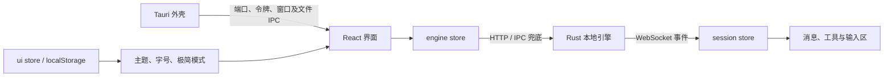

# Coomi Desktop · 极简界面改造

参考代码：`F:/_WorkSpace/Projects/Coomi-Android/apps/web/src`。桌面端基线为 `origin/coomi-desktop`，提交 `4e10c7b`。

## 项目结构与改造边界

| 层级 | 位置 | 职责与界面关系 |
| --- | --- | --- |
| 桌面外壳 | `apps/desktop` | Tauri 2，管理窗口、文件选择、引擎生命周期、IPC 与打包。通过启动注入或 `engine_info` 向界面提供本地端口与令牌。 |
| 前端 | `apps/desktop-ui-react` | React 19、TypeScript、Vite 7、Tailwind 4；Radix 提供菜单与弹窗，Zustand 管理状态，Motion 处理过渡。 |
| 引擎 | `apps/coomi-rs` | Rust workspace：engine、services、tools、security、ui、catalogs、telemetry。HTTP 提供配置与资源，WebSocket 提供会话事件。 |
| 内容渲染 | 前端 `components/chat`、`components/richtext` | 消息、工具、Markdown、代码、文件与沙箱预览。长会话有窗口切片和虚拟列表。 |
| 设计系统 | 前端 `styles`、`components/ui` | 配色、字号、间距、动效与基础控件；必须统一修改，避免页面各自补色。 |



`App.tsx` 管理固定导航、可调整宽度的会话栏、主内容和右侧工具栏。窄窗口会话栏使用抽屉。页面具有缓存、惰性加载和切换期间的调度控制，因此本次沿用既有布局和数据链路，在组件及设计令牌层实现改造。

`session.ts` 是会话与草稿的状态来源，`lib/chat.ts` 负责历史与流式事件映射。新首页的任务入口通过 `setDraft()` 填入现有草稿，并通过 `focusComposer()` 请求聚焦；有草稿时追加内容，不自动发送。审批继续由独立的 `ApprovalDialog` 处理。

插件主题通过 CSS 变量与 `data-theme-mascot` 等挂点自定义界面。品牌图片继续使用仓库中的 Coomi 标识，没有新增外部字体、图床或运行时设计依赖。

## 移动端设计来源

主要参考文件：

- `styles/global.css`：品牌蓝 `#2d61c6`、淡蓝选中态 `#eaf0fc`、灰色填充 `#f5f6f8`、正文 `#1b1e23`、卡片圆角 16px，以及深色主题。
- `components/ToolGroup.vue`：将工具执行合为小块摘要，保留运行、失败及展开状态。
- `views/ChatView.vue` 与 `views/SettingsView.vue`：极简模式入口、紧凑文字和工具细节的层次。

桌面端保留键盘焦点环、可拖拽分栏和鼠标悬停反馈。正文与字号沿用用户的缩放偏好；极简模式的文字更紧凑，但不会关闭富文本、文件预览或修改工具权限。

## 最终设计

| 区域 | 实现 |
| --- | --- |
| 全站配色 | 白色主画布、浅灰侧栏、蓝色选中态，统一原来混用的冷灰、暖灰和高饱和橙色；深色以蓝灰层级对应。 |
| 一级导航 | 图标下方增加简短标签，使用淡蓝选中块和 `aria-current`，减少仅凭图标猜入口的负担。 |
| 会话侧栏 | 标题为“Coomi”，移除 BETA；统一使用“会话”，保留新建、搜索与选中行。一级导航不再重复放置品牌图标。 |
| 首页 | 48px Coomi 图标；Coomi. 与标语默认使用国风艺术字，最大宽度分别为 104px、420px。在外观设置的“初始会话界面标语字体”选择“默认”后，两者同步切为无衬线文字。选择即时生效并保存。辅助文案为“准备好了，就告诉我想做什么”；四个建议入口写入真实草稿。 |
| 输入区 | 18px 圆角、细边框、轻阴影与聚焦反馈；模型入口药丸化；工具行可以换行。工作目录降为辅助信息，空会话不显示无意义的零用量。 |
| 极简模式 | 默认开启，会话页和设置页共用同一偏好，持久化到现有 `coomi.prefs.v2`。首页使用固定艺术字，不再轮播文案。 |
| 工具调用 | 单个或多个调用都默认收为摘要；展示运行进度、完成状态、失败数和累计工具时长。用户可展开运行中的调用。失败/拒绝在尚未手动选择开合时自动展开。 |
| 键盘与无障碍 | 折叠按钮使用 `aria-expanded` / `aria-controls`，收起的详情加 `inert`，避免 Tab 进入看不见的内容；补充搜索、输入、上传和极简开关的名称。 |
| 设置 | 参考 Codex 的分类导航与设置行：左侧关键词搜索和八个分类，右侧单列，标签在左、控件在右，用分隔线代替圆角卡片。模型服务商也改为列表。 |
| 标题栏 | 文件、编辑、视图、帮助均有实际菜单动作；三个窗口按钮统一 16px 图标和 46px 点击宽度，关闭提示明确说明收起到托盘。 |
| 主题与通知 | 新用户默认亮色；系统颜色变化仅在“跟随系统”模式生效。通知读取应用实际主题，并提供右上角关闭按钮。 |
| 帮助与引导 | 帮助入口移至顶部菜单，按篇阅读；启动引导以三条摘要呈现，完整说明可展开。修正数据外发说明后内容版本更新为 2。 |
| 桌面托盘 | 关闭窗口保留后台任务，旧 closeToTray=false 不再覆盖此策略，完全退出从托盘菜单执行。托盘创建失败时保留系统关闭行为，避免窗口无法找回。 |

标准模式仍保留原有规则：运行中的工具强制展开，三个以内平铺，更多工具结束后可折叠。极简模式是展示偏好，与安全模式、性能模式及工具权限分别管理。

## 一并修复的公共组件问题

1. `Button.tsx` 中 `h[calc(...)]` / `w[calc(...)]` 缺少连字符，不是有效的 Tailwind 任意值语法。改为 `h-[calc(...)]` / `w-[calc(...)]`，恢复随字号缩放的尺寸。
2. 默认 `tailwind-merge` 不认识 `text-13` 等自定义字号，会错误覆盖 `text-white`、`text-primary` 等颜色。`cn.ts` 现在注册全部数字字号，使字号与文字颜色独立合并。

## 验证与已知限制

- `npm run build`：TypeScript 与 Vite 生产构建通过。
- `npm run test:ui`：11 条工具折叠断言、2 条字号与颜色合并断言通过。
- `npm run test:visual`：默认 HarmonyOS 字体下，深浅主题、四个主页面、草稿填入与聚焦、设置持久化、工具展开、右侧面板、900×700 窄窗口、抽屉、118% 字号及减少动态效果检查通过。浏览器未捕获到未处理的运行时异常。
- 现有 `check-render-stability`、`check-msg-visibility`、`check-bootstrap`、`check-session-input`、`check-empty-session` 共 59 条断言通过；连同新增测试共 72 条针对性断言通过。

浏览器截图中的会话、模型和工具结果均为测试数据，不代表实际调用模型。浏览器验收不等同于 Windows 安装包与真实引擎端到端验收；本次未构建 Rust 引擎或发布安装包。

追加验证覆盖八个设置分类的布局、应用菜单导航、编辑菜单焦点与全选、亮色默认值、手动主题不被系统覆盖、通知主题与关闭按钮、帮助单篇阅读和引导详情/同意流程。Rust 桌面壳使用 `TAURI_CONFIG={"bundle":{"resources":[]}}` 完成 `cargo check`，仅在检查时跳过仓库缺少的 `coomi.exe` 打包资源；未伪造引擎文件。真实托盘点击和安装包运行仍需完整引擎资源验证。

分支基线已存在 `tests/check-chat-pipeline.mjs` 两条失败：历史助手消息合并为一条，导致条数和顺序段断言与当前实现不同。在临时目录从 Git HEAD 导出原始源码及测试后，可复现完全相同的 2/63 失败。本次未修改该消息合并逻辑。生产构建另有已有的大 chunk 与静态/动态导入混用警告。

## 界面截图

截图使用测试数据，1440×960 桌面窗口，另附窄窗口与大字号场景。

- [浅色首页](screenshots/01-welcome-light.png)
- [深色首页](screenshots/02-welcome-dark.png)
- [外观设置](screenshots/03-settings.png)
- [极简对话与工具摘要](screenshots/04-conversation.png)
- [窄窗口](screenshots/05-compact-window.png)
- [技能中心](screenshots/06-skills.png)
- [产物中心](screenshots/07-artifacts.png)
- [大字号](screenshots/08-large-font.png)
- [模型设置](screenshots/settings-models.png)
- [可关闭的通知](screenshots/09-notification-dark.png)
- [帮助中心](screenshots/10-help.png)
- [精简引导](screenshots/11-onboarding.png)

## 本地运行

```powershell
cd apps/desktop-ui-react
npm ci
npm run dev -- --host 127.0.0.1
```

浏览器访问 `http://127.0.0.1:5273/`。真实对话、文件选择等能力需要 Tauri 外壳和本地引擎；裸浏览器会明确提示尚未连接桌面应用。

浏览器自动验收另需使用独立临时用户目录启动 Edge/Chrome，添加 `--headless=new --remote-debugging-port=9337` 参数，再运行 `node tests/visual-review.mjs`。端口被系统保留时，可使用 `--remote-debugging-port=0`，从临时目录的 `DevToolsActivePort` 读取端口，通过 `COOMI_REVIEW_PORT` 环境变量传给测试。测试脚本不会写入真实 Coomi 用户目录或连接真实模型。
